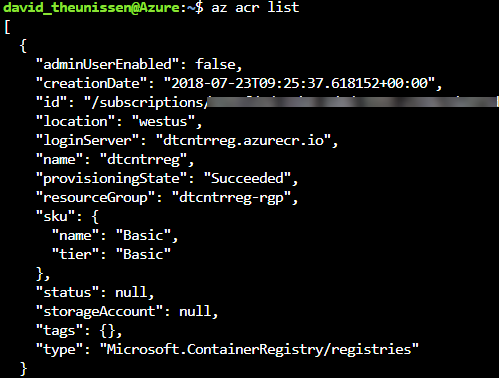
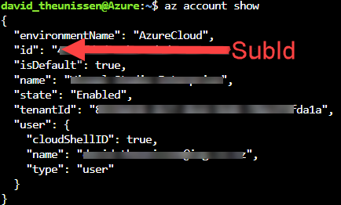
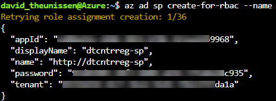

## What you will learn

In this post you will learn how to provision a new Azure Container Registry instance, create a new service principal and publish a Docker image to the registry.

## What you will need

To follow along with this post you will need the following;

- [Microsft Azure Account](https://azure.microsoft.com/en-us/free/)
- [Azure CLI 2.0](https://docs.microsoft.com/en-us/cli/azure/install-azure-cli?view=azure-cli-latest)
- [Docker](https://www.docker.com/community-edition)

For all the Azure CLI tasks, you have the option of using the [Azure Cloud Shell](https://shell.azure.com/) which already has the Azure CLI pre-configured.

Although Azure Cloud Shell also includes the Dockler CLI, you will need to have Docker installed locally to build and push images. This is because the Docker deamon is not included in ACS.

If you are not that comfortable with the command line, the [Azure Portal](https://portal.azure.com) provides a rich user experience that is a really great tool for quickly setting up Azure resources. The [ACR Microsoft Docs]((https://docs.microsoft.com/en-us/azure/container-registry/container-registry-get-started-portal)) include a quickstart tutorial for setting up an ACR instance from the portal.

## Part 1 - Provision an Azure Container Registry

To get started, go ahead and launch the Azure Cloud Shell.

[](https://shell.azure.com)

If you are running these scripts from your machine, you will need to authenticate with Azure first.

```bash
# Authenticate with Azure
az login
```

### Create a new Resource Group

If you don't already have a resource group setup, you can create one as follows.

```bash
# Create a new resource group
az group create --location westus --name {YourResourceGroupName}
```

`--location` - The region this resource group will reside in.

`--name` - The name of your resource group.

### Create a new Azure Container Registry

```bash
# Create a new azure container registry
az acr create --name <YourResourceName> --resource-group {YourResourceGroupName} --sku Basic
```

`--name` - The name of your ACR instance. (Must be alphanumeric with a minimum of 5 characters)

`--resource-group` - The name of your resource group

`--sku` - The tier of your resource. (Stock Keeping Unit)

You've now successfully provisioned an ACR instance to Azure. Run the following to output details of your new ACR resource.

```bash
# List all azure container registries
az acr list
```



### Create a Service Principal

Your ACR is essentially a private container image repository which means you need a mechanism to authenticate with the registry to push and pull images. There are multiple ways to authenticate with your ACR, and Azure Active Directory (AAD) service principals are just one of them.

AAD service principals allow us to perform headless authentication which is useful when you want to allow services like Kubernetes to fetch images directly from your repo. Deplying Azure Functions with Kubernetes is going to feature in a future post so lets go ahead and setup a service principal.

For the next step you will need your subscription id.

```bash
# Show details of the current subscription
az account show
```



Create the service principal and grant it contributor right to your ACR instance.

```bash
# Create a new sp and add it to a resource
az ad sp create-for-rbac --name {YourServicePrincipalName} --role contributor --scopes /subscriptions/{YourSubId}/resourceGroups/{YourResourceGroupName}
```

`--name` - The name of your service principal

`--role` - The role to assign your service principal.

- Reader: pull
- Contributor: pull and push
- Owner: pull, push, and assign roles to other users

`--scopes` - This scopes the service principal to apply only to the resource group specified. If you leave this off, the service principal will be created as a contributer at the subscription level.

The result should look something like this. Take note of the app id and password because these represent the username and password you will use to authenticate to your ACR instance.



> **Tip:** For security reasons, AAD won't let see this password again, but you can [generate new credentials](https://docs.microsoft.com/en-us/cli/azure/ad/sp/credential?view=azure-cli-latest#az-ad-sp-credential-reset) if you need to.

For more information on how to create service principals via the Azure CLI have a look at the [AAD Microsoft Docs](https://docs.microsoft.com/en-us/cli/azure/ad/sp?view=azure-cli-latest). For more detailed information on ACR authentication and the different options available to you, checkout the [ACR Microsoft Docs](https://docs.microsoft.com/en-us/azure/container-registry/container-registry-authentication).

## Part 2 - Publish a Docker Image to ACR

The final part of this post will cover how to publish a docker image to your private ACR.

### Login to your ACR instance with Docker

```bash
# Login to ACR from Docker
docker login {YourAcrName}.azurecr.io --username {YourSerivcePrincipalName} --password {YourServicePrincipalPassword}
```

> For convience the `--password` flag is included in the command above. The Docker CLI will give you a warning about using `--password` because this will store the password in your shell history. You can leave the password flag off and the Docker CLI will prompt you to enter it which won't be stored anywhere. For more info checkout the [Docker Docs.](https://docs.docker.com/engine/reference/commandline/login/#extended-description)

### Tag a Docker Image

For this example, lets just pull the hello-world docker image which you will then push to your ACR instance.

```bash
# pull hello-world image from docker hub
docker pull hello-world

# tag the image for Azure Container Registry
docker tag hello-world {YourAcrName}.azurecr.io/hello-world
```

### Push the image to Azure Container Registry

```bash
# push the docker image to Azure Container Registry
docker push {YourAcrName}.azurecr.io/hello-world
```

Finally, confirm that the hello-world image has been pushed to your ACR instace

```bash
# list all the images in a Azure Container Registry instance
az acr repository list --name {YourAcrName}
```

Awesome! If you got this far, you've successfully provisioned an Azure Container Registry and added a Docker image to your private repository. You are now setup to spin up container instances via ACI or Kubernetes using your own container images stored in the cloud! 

If you enjoyed this post, give me a retweet on twitter!