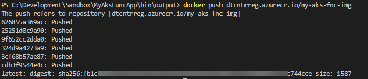

## What you will learn

In this post you will learn how to deploy and run a simple .Net Core [Azure Function v2](https://docs.microsoft.com/en-us/azure/azure-functions/functions-versions) in Kubernetes. This will involve creating a Docker image that includes your function and the Azure Function Runtime. You will publish your function container image to Azure Container Registry and from there, you will deploy the container to K8s and then expose a k8s service to allow ingress to your function endpoint.

## What you will need

- [Microsft Azure Account](https://azure.microsoft.com/en-us/free/)
- [Azure CLI 2.0](https://docs.microsoft.com/en-us/cli/azure/install-azure-cli?view=azure-cli-latest)
- [Docker](https://www.docker.com/community-edition)
- [Azure Functions Core Tools](https://github.com/Azure/azure-functions-core-tools)
- [Azure Container Registry](https://azure.microsoft.com/en-us/services/container-registry/) - You could use Docker Hub but that's not covered here. If you are not familiar with Azure Container Registries, have a look at [my previous post.](https://davetheunissen.io/azure_container_registry/)
- [Azure Kubernetes Service](https://azure.microsoft.com/en-us/services/kubernetes-service/) - You could use any Kubernetes instance. If you've never provisioned an Azure Kubernetes Service before, take a look at [this awesome AKS and Graphana workshop](https://github.com/PlagueHO/Workshop-AKS) put together by Microsoft MVP [@dscottraynsford](https://twitter.com/dscottraynsford)

## Part 1 - Create and Run an Azure Function

Part 1 of this post will show you how to create and run a new Azure Function via the Azure Functions Core Tools CLI.

### Step 1 - Create a new Azure Function App

Azure Functions Core Tools gives you the ability to scafold new Azure Function Apps quickly via the command line. The core tools include a `--docker` flag which will create a Docker file when setting up the new project.

Run the following and select `dotnet` as the runtime.

``` bash
# Create a new Azure Function App
func init MyAksFuncApp --docker --no-source-control
```


Inspect the project thats been created and notice the Dockerfile which should look similar to this

```docker
FROM microsoft/azure-functions-dotnet-core2.0:2.0
ENV AzureWebJobsScriptRoot=/home/site/wwwroot
COPY . /home/site/wwwroot
```

### Step 2 - Create a new Http Triggered Azure Function

Make sure to change directory to the `MyAksFuncApp` folder that you created in the previous step.

```bash
# Change working directory
cd .\MyAksFuncApp\
```

Run the following command and then choose `HttpTrigger` from the list of options.

```bash
# Create a new Azure Function
func new --name MyAksFunc
```


Inspect the files that have been created. You will see a .cs file with your functions name. The function that has been created is a simple http triggered function that takes a name as a query string and returns that text in a response. Checkout the [Azure Functions Docs](https://docs.microsoft.com/en-us/azure/azure-functions/functions-versions#bindings) for more information on function triggers and bindings.

### Step 3 - Build and run your function

Before building your function, for the purpose of this post, we are going to set the functions authorization level to anonymous. This will allow you to invoke your function later on without requiring a function key. For more info, checkout the [authentication keys section](https://docs.microsoft.com/en-us/azure/azure-functions/functions-bindings-http-webhook#authorization-keys) in the Azure Function Docs.


To build and execute your function run the following.

```bash
# Build and run the Azure Function
func start --build
```


Open the function url in your browser. Add a query string parameter for your name and send the request. You should see a response similar to below.


## Part 2 - Build and run your Azure Function in a Docker Container

### Step 1 - Temporary workaround for compiled functions

There is a known issue with compiled functions at the moment that require the `--build` flag to be included when running a function locally. This means that you will need to build your Docker image from the `output` folder that was created when you compiled your function. [There is an issue open on GitHub.](https://github.com/Azure/azure-functions-core-tools/issues/553)

Copy the pre generated Dockerfile from the root directory to `./bin/output` and then change your working directory to this location

```bash
# Copy the Dockerfile to the target directory
cp Dockerfile .\bin\output\
# Change working directory
cd .\bin\output\
```

> The next step will build your docker image from this location. Once this issue is resolved, you should be able to build your docker image from the root directory of your project.

### Step 2 - Create a Docker Image

Start off by building a Docker image that includes your function and the Azure Functions runtime. The Dockerfile that was created at the start will pull down the functions runtime image from docker hub. In this instance I've taged the docker image with the Azure Container Registry repository we [created in a previous post.]((https://davetheunissen.io/azure_container_registry/))

To build your docker image run the following. **(Don't miss the period at the end of the command)**

```docker
# Build a docker image with a tag
docker build -t {YourAcrName}.azurecr.io/my-aks-fnc-img .
```


### Step 3 - Run your Docker image locally

Lets spin up a Docker container with the image of your Azure Function to check that everything is still working as we'd expect.

```docker
# Run a docker image and expose port 80
docker run --rm -p 80:80 dtcntrreg.azurecr.io/my-aks-fnc-img:latest
```

Now open up `localhost` in your browser and you should see something similar which indicates that your function host is running. Notice that your function is running on port 80 as per the command above. You can also add `/api/MyAksFunc` to test your function just like before.


>This is an awesome milestone! You now have an Azure Function running inside a Docker container on your local machine!

### Step 4 - Publish your Docker image to Azure Container Registry

Now that we have a working Azure Function and a tagged Docker image, you are ready to push your image to your Azure Container Registry.

Refer back to [Part 2](https://davetheunissen.io/azure_container_registry/) of my ACR post if you've forgotten your username or password.

```docker
# Login to ACR from Docker
docker login {YourAcrName}.azurecr.io --username {YourSerivcePrincipalName} --password {YourServicePrincipalPassword}
```


Finally push the image to your ACR instance

```bash
# Push the docker image to Azure Container Registry
docker push {YourAcrName}.azurecr.io/my-aks-fnc-img
```



## Part 3 - Run your Azure Function in Kubernetes