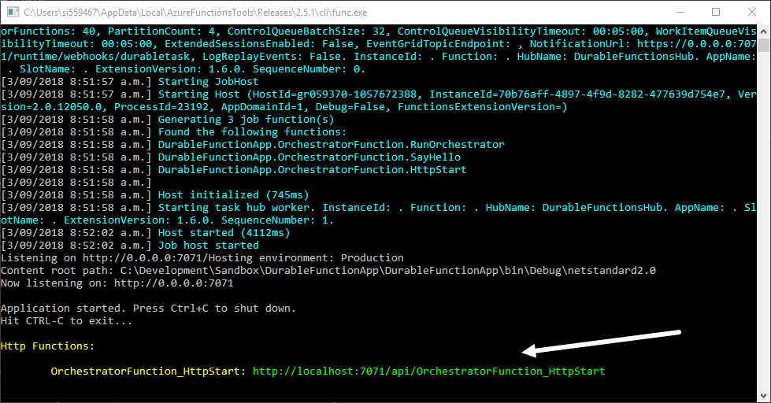
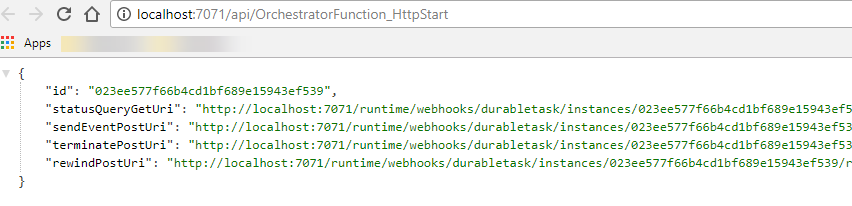
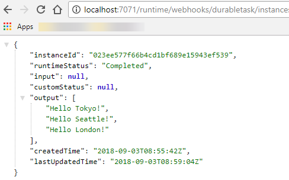

## What you will learn

In this post we'll take a look at the Durable Function extension for Azure Functions.

### Azure Functions

Azure functions are designed for stateless execution of small units of code. They are intended to be lightweight functions that are executed in the cloud without the need to know about the underlying infrastructure etc. In reality they do grow in size and complexity when you need to process data or integrate with other systems. One of the challenges with stateless functions is coordinating workflows between multiple functions particularly in a micro service architecture.

### Durable Function Extension

The Durable Functions extension allows you to create stateful functions which greatly simplifies the effort required to coordinate work between multiple disparate functions and services. Durable functions introduce two types of functions, Orchestrator and Activity functions. Orchestrator functions are the coordinators responsible for invoking Activity functions in a reliable and repeatable way. Activity functions are much like regular functions in that they are stateless. Activity functions take input from the orchestrator function, execute some logic and report back to the orchestrator when complete.

Orchestrator functions can execute Activity functions in series or in parallel and therefore there are a number of patterns you can use to solve for different scenarios. The [Microsoft Docs on Durable Functions](https://docs.microsoft.com/en-us/azure/azure-functions/durable-functions-overview) has some excellent introductions to common patterns.

Some things to know

- Orchestrator function code must be deterministic.
- Local state is persisted whenever the function awaits.
- Orchestrators should not perform any I/O operations.
- You can find out more information about [Performance and scaling of Durable Functions](https://docs.microsoft.com/en-us/azure/azure-functions/durable-functions-perf-and-scale) over on the Microsoft Docs.

## What you will need

- [Visual Studio 2017 Community Edition](https://visualstudio.microsoft.com/vs/community/)
- [Visual Studio Extension - Azure Functions & Web Jobs Tools](https://marketplace.visualstudio.com/items?itemName=VisualStudioWebandAzureTools.AzureFunctionsandWebJobsTools)

## Part 1 - Create a new Durable Function Project

### Create a new Azure Function App Project


Durable functions are only available on the Functions v2 framework. 

Create an empty function app and select the storage emulator for the storage account.


### Add a new Durable Function to the project


>Select the Azure Function item from the menu and select **Add**


>Select Durable Functions Orchestration and select **OK**


## Part 2 - Review the Code

Let's take a look at the code that has been scoffolded out by the Visual Studio Templates.

### Orchestrator Client Function

```csharp
[FunctionName("OrchestratorFunction_HttpStart")]
public static async Task<HttpResponseMessage> HttpStart(
    [HttpTrigger(AuthorizationLevel.Anonymous, "get", "post")]HttpRequestMessage req,
    [OrchestrationClient]DurableOrchestrationClient starter,
    ILogger log)
{
    // Function input comes from the request content.
    string instanceId = await starter.StartNewAsync("OrchestratorFunction", null);

    log.LogInformation($"Started orchestration with ID = '{instanceId}'.");

    return starter.CreateCheckStatusResponse(req, instanceId);
}
```

The Orchestrator Client is the entry point for creating new instances of an Orchestration Function. You will notice that the Function is decorated with an `OrchestrationClient` attribute which exposes a `DurableOrchestrationClient` object. Using this client, you start a new Orchestration function with `StartNewAsync(string, object)` where the 1st param is the name of the durable orchestrator function and the 2nd param is a JSON-serializable input value which you would use to provide input data to the orchestrator.

The 2nd key thing to notice is that the Orchestrator Client returns a `CheckStatusResponse` which contains a set of URLs for inspecting the status of an orchestration execution. The default endpoints that you will get back are;

- StatusQueryGetUri - Get the status of a running orchestration instance.
- SendEventPostUri - Send an event notification to a running orchestration instance.
- TerminatePostUri - Terminate an instance of a running orchestration.
- RewindPostUri - Rewind a running orchestration instance to a replay events from a previous checkpoint.

In this example the Orchestrator Client is an HttpTrigger. It's important to note that the `OrchestratorClient` can be triggered by any of the supported Azure Function Triggers e.g. TimerTrigger, QueueTrigger, CosmosDbTrigger etc. See [here](https://docs.microsoft.com/en-us/azure/azure-functions/functions-triggers-bindings#supported-bindings) for more info on function bindings and triggers.

### Durable Orchestration Function

```csharp
[FunctionName("OrchestratorFunction")]
public static async Task<List<string>> RunOrchestrator(
    [OrchestrationTrigger] DurableOrchestrationContext context)
{
    var outputs = new List<string>();

    // Replace "hello" with the name of your Durable Activity Function.
    outputs.Add(await context.CallActivityAsync<string>("OrchestratorFunction_Hello", "Tokyo"));
    outputs.Add(await context.CallActivityAsync<string>("OrchestratorFunction_Hello", "Seattle"));
    outputs.Add(await context.CallActivityAsync<string>("OrchestratorFunction_Hello", "London"));

    // returns ["Hello Tokyo!", "Hello Seattle!", "Hello London!"]
    return outputs;
}
```

The Durable Orchestration Function is the conductor and is responsible for coordinating requests to activity functions. You will notice that the function is decorated with a `OrchestrationTrigger` attribute which exposes the `DurableOrchestrationContext` This context is what is used to invoke and interact with Activity functions.

As mentioned above, orchestrator functions checkpoint their progress after each await. The above code therefore executes each Activity function in series, only progressing to the next function after the current invoked function returns. If you wanted to execute all of the above Activity functions in parallel, you would create a list of Task objects that represent the asynchronous operations and then call `Task.WhenAll(List<Task<string>)`

The below example shows how to queue up parallel activity invocations.

```csharp
var parallelActivities = new List<Task<string>>
{
    context.CallActivityAsync<string>("OrchestratorFunction_Hello", "Tokyo"),
    context.CallActivityAsync<string>("OrchestratorFunction_Hello", "Seattle"),
    context.CallActivityAsync<string>("OrchestratorFunction_Hello", "London")
};
await Task.WhenAll(parallelActivities);
```

### Activity Function

```csharp
[FunctionName("OrchestratorFunction_Hello")]
public static string SayHello(
    [ActivityTrigger] string name, 
    ILogger log)
{
    log.LogInformation($"Saying hello to {name}.");
    return $"Hello {name}!";
}
```

The Activity Function is the equivalent of a regular Azure Function with the difference being that it is invoked by a durable orchestrator. It performs some logic in a stateless way and returns a response to it's parent orchestration function. You will notice that this function is decorated with an `ActivityTrigger` attribute.

## Part 3 - Trigger a Durable Function

Finally start up your Function App and call the endpoint of your locally hosted Orchestrator Client in your browser or via PostMan. It should be similar to `http://localhost:7071/api/OrchestratorFunction_HttpStart`



Once you make a request to this endpoint, you will get back a list of URLs as described above.



Navigate to the `statusQueryGetUri` and observe the status of your new durable function instance.



As you can see from the runtimeStatus, this orchestration invocation has completed and the output is the names of the cities returned by each of my activity functions.

This has been a brief introduction into the Durable Functions extension and hopefully lowers a few barriers for having a go at creating your own. In a future post I'd like to explore how Durable Functions maintain state through the use of queues and table storage but for now this should be enough to get you up and running.

All of the code for this extension is open source and can be found over on the [Azure Functions Durable Extension GitHub Repo](https://github.com/Azure/azure-functions-durable-extension)