## What you will learn

Microsoft recently announced the rebranding of VSTS to Azure DevOps. One of the awesome new features of Azure DevOps is free CI/CD [Azure Pipelines](https://azure.microsoft.com/en-us/pricing/details/devops/azure-pipelines/) for open source projects with unlimited minutes and 10 parallel jobs.

In this post we will take a look at how to configure a Azure DevOps build and release pipeline for a Azure Function from a public GitHub repo.

## What you will need

- [GitHub account](https://github.com)
- [Microsoft Azure Account](https://azure.microsoft.com/en-us/free/)
- [Azure Pipelines Account](https://azure.microsoft.com/en-us/services/devops/pipelines/)
- [An Azure Function GitHub Repo](https://github.com/davetheunissen/SimpleAzureFunctionApp) - Feel free to fork the one I put together for this post.

The rest of this post will walk you through setting up new Azure DevOps build & release pipelines for your GitHub repository.

***

### GitHub Marketplace - Azure Pipelines Plugin

Lets get started by heading over to the [Azure Pipelines plugin over on the GitHub Marketplace](https://github.com/marketplace/azure-pipelines).

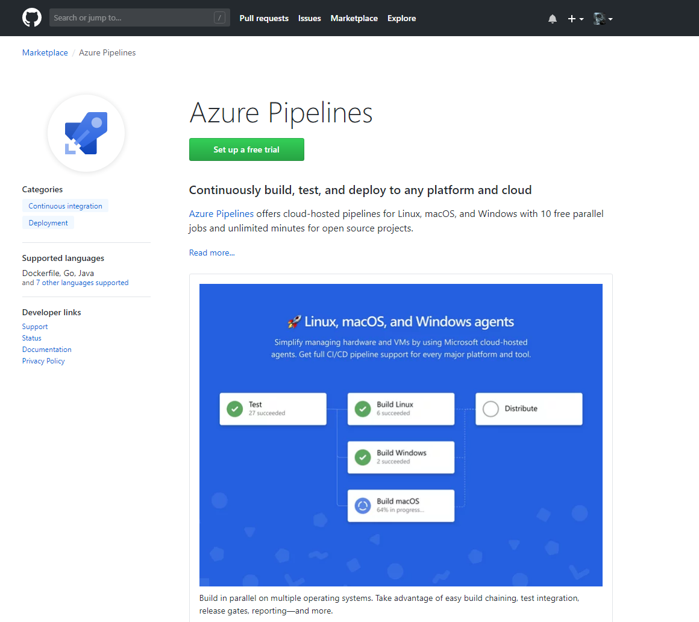

After selecting to setup a free trial, choose the free edition on the Pricing and setup page. As you can see from the product description, the free version is available for all public and private repos across Linux, macOS and Windows. You also get unlimited free minutes for public repositories.

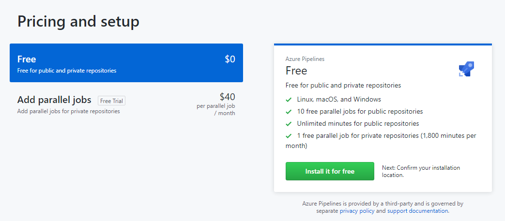

Once you've selected to **Install it for free**, you will be prompted to configure which GitHub repositories the Azure Pipelines should have access to. In this case, I've simply granted access to my SimpleAzureFunction project.

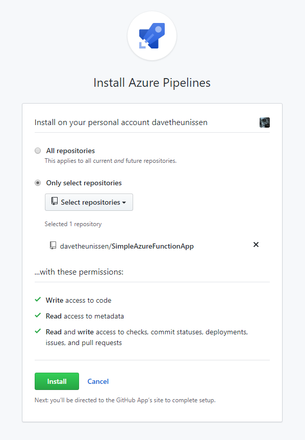

***

### Azure DevOps Build Pipeline

Once the plugin has been installed, you will be redirected to the Azure DevOps portal. If you don't already have an account, go ahead and sign up. Once you have logged in, you will be prompted to configure a new project. In this case I created a new project called SimpleAzureFunction.

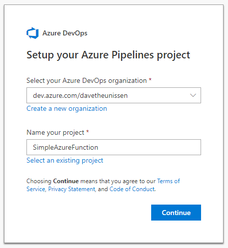

***

Next you will be presented with the new pipeline wizard which will guide you through setting up the build pipeline. The first thing to do here is select which repository this build definition is for. If you have a long list of projects, use the filter box to search for your GitHub repo.

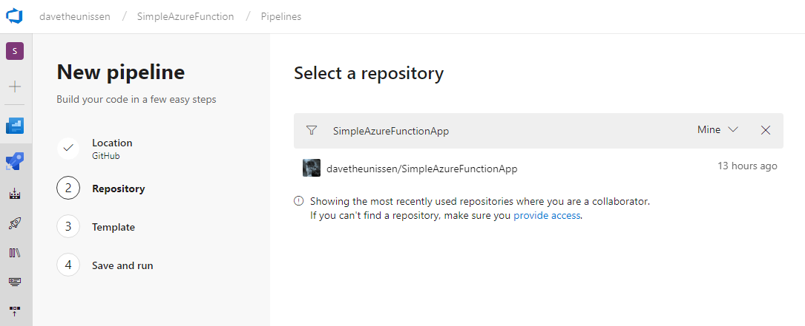

Once you've configured which repository the pipeline should point to, Azure DevOps will analyse the GitHub repo and recommend a build template.  
If you've forked my [SimpleAzureFunction](https://github.com/davetheunissen/SimpleAzureFunctionApp) repo, you will already have a `azure-pipelines.yml` which means you will go straight to the run step.

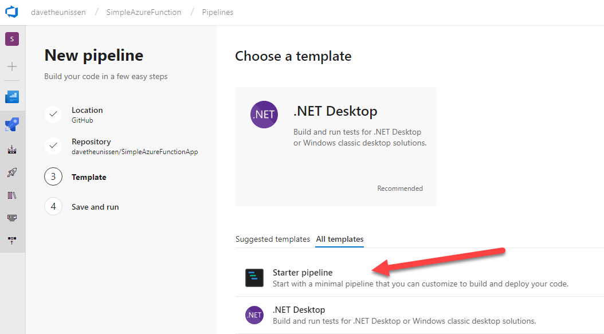

If you are following along from scratch, select the **starter template** and replace the contents of the `.yml` file with the code snippet below.


```yaml
# ASP.NET Core
# Build and test ASP.NET Core web applications targeting .NET Core.
# Add steps that run tests, create a NuGet package, deploy, and more:
# https://docs.microsoft.com/vsts/pipelines/languages/dotnet-core

pool:
  vmImage: 'Ubuntu 16.04'

variables:
  buildConfiguration: 'Release'

steps:
- task: DotNetCoreCLI@2
  displayName: Restore & Build Project
  inputs:
    command: build
    projects: '**/*App/*.csproj'
    arguments: '--configuration $(BuildConfiguration)'
    zipAfterPublish: true

- task: DotNetCoreCLI@2
  displayName: Run Unit Tests
  inputs:
    command: test
    projects: '**/*Tests/*.csproj'
    arguments: '--configuration $(buildConfiguration)'

- task: PublishBuildArtifacts@1
  displayName: Publish Artifacts
  inputs:
    PathtoPublish: 'src/SimpleAzureFunctionApp/bin/Release/netstandard2.0' 
```

This build definition has a couple of key steps. Firstly, notice that the build agent will be hosted on Linux OS. Of course we could select Windows or macOS here but because dotnet core is cross platform, lets stick with Ubuntu... because why not. You could even configure build pipelines for each OS and run them in parallel.

- The 1st task to run will restore the Nuget packages and build the project. Notice that I specified the path to my `.csproj` file because it's not at the root of the project directory. Also, I've configured the task to zip the artefacts after publishing. This will make sense a little further on when we use zip deploy in the release pipeline to deploy the function to Azure.
- The 2nd task will run the unit tests and publish the results to the Azure DevOps build dashboard.
- The 3rd and final task publishes the build artifacts so that we can use them later in a release pipeline.

For more info on setting up the build definitions have a look at these resources over on the Microsoft Docs

- [How to build .NET Core projects.](https://docs.microsoft.com/en-us/azure/devops/pipelines/languages/dotnet-core?view=vsts&tabs=yaml)
- [Build Tasks](https://docs.microsoft.com/en-us/azure/devops/pipelines/tasks/build/dotnet-core-cli?view=vsts)

***

### Run the new Build Pipeline

Once you save and run the build definition, if everything works as expected, you should see a build summary similar to the one below. This view gives a really great summary of the steps that were executed during the build. In addition, any future commits that are pushed to your repository will automatically trigger a new build.

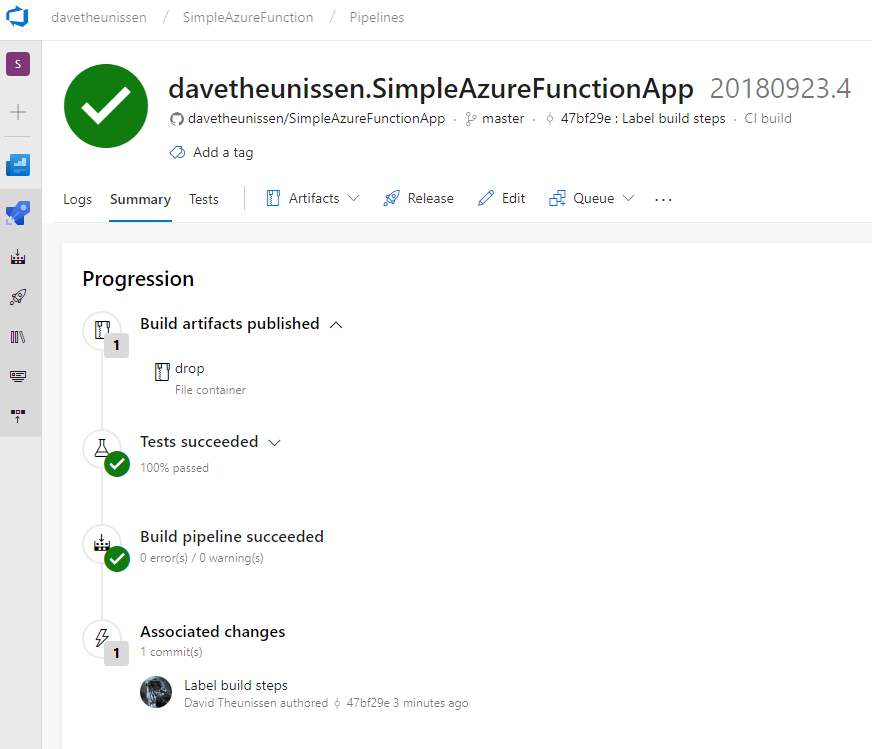

If you head over to the **Tests** tab, you will get a really neat unit test execution summary. In this case my 1 test passed and build pipeline is green. Congrats, you've just setup a CI build for your public GitHub repo!

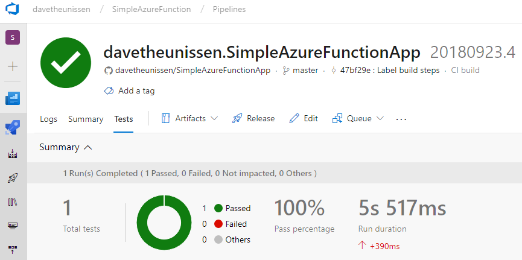

#### Add a Build Status Badge

The final icing on the cake is adding an awesome build badge to your README file. Navigate back to the build icon on the left, open the menu dropdown from the ellipsis and select **Status Badge**. Copy the markdown and add it to your README. Now you know the status of your build pipeline right from the GitHub repo itself.

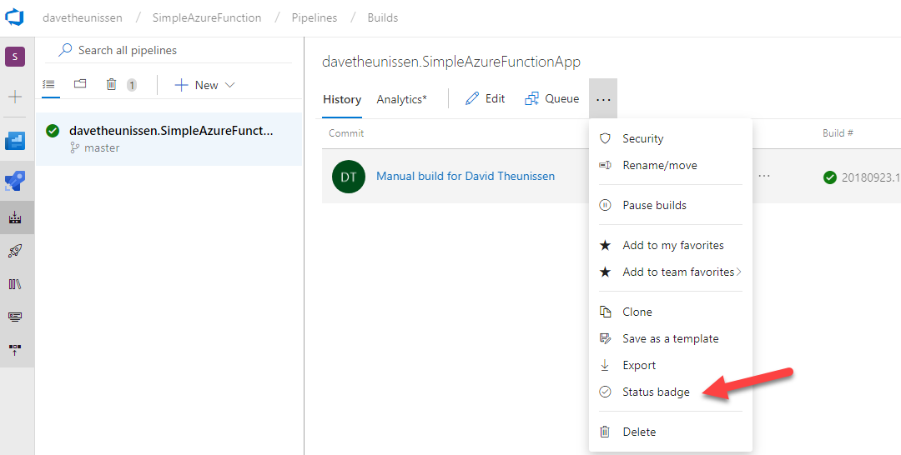

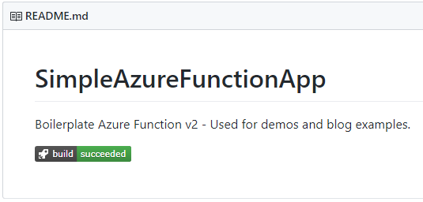

***

### Create a new Function App in Azure

Next we are going to look at creating the release pipeline using the [Azure App Service Deploy Task](https://docs.microsoft.com/en-us/azure/devops/pipelines/tasks/deploy/azure-rm-web-app-deployment). One of the [pre-requisites for this task](https://docs.microsoft.com/en-us/azure/devops/pipelines/tasks/deploy/azure-rm-web-app-deployment?view=vsts#pre-requisites-for-the-task) is an existing Azure App Service instance. Go ahead and create a new Function App in Azure. In a future post, I plan on taking a look at using something like [Terraform](https://www.terraform.io/) to automate the provision of resources in Azure.

[Microsoft Docs for creating a new Function App](https://docs.microsoft.com/en-us/azure/azure-functions/functions-create-function-app-portal)

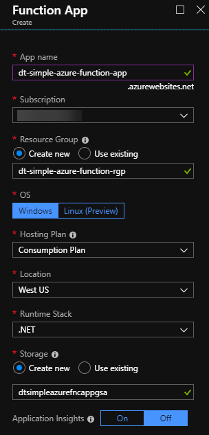

***

### Azure DevOps Release Pipeline

Back in the Azure DevOps portal, click on the rocket icon in the left hand menu to open the release console. You will get an image like the one below. Click on **New pipeline** to get started with a new release pipeline. Unlike the build definitions, Azure DevOps doesn't yet support `.yml` definitions for release pipelines although it is on the [2018 Q3 Backlog](https://docs.microsoft.com/en-us/azure/devops/release-notes/). So for now, this will all be configured in the Azure DevOps portal directly.

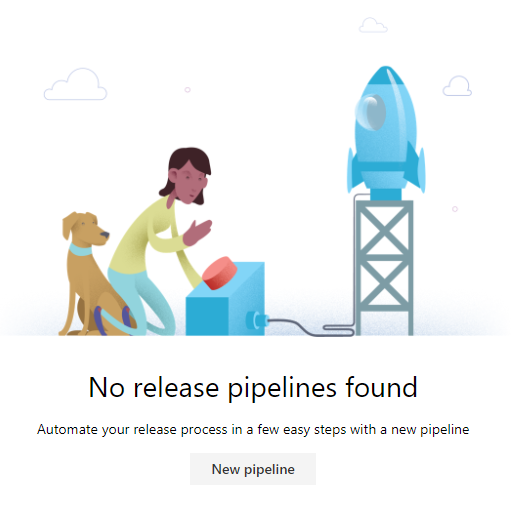

For this deployment we are going to be using the [Azure App Service Deploy Task](https://docs.microsoft.com/en-us/azure/devops/pipelines/tasks/deploy/azure-rm-web-app-deployment).


Give your release stage a meaningful name. In this case I've named mine `Development`. You now have a release definition shell. Next we will add deployment artifacts and configure the pipeline.

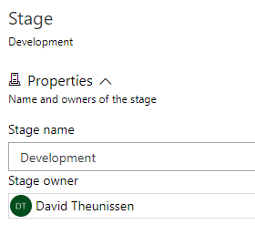

#### Add Deployment Artifacts

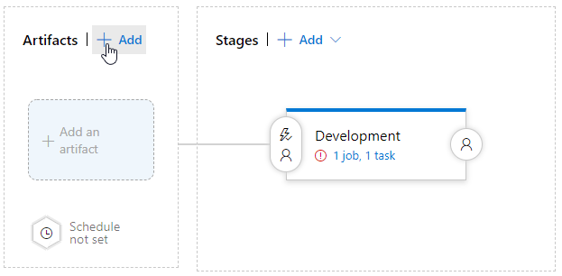

We are going to configure this release pipeline to use the build artifacts that we published as part of the build pipeline setup. Select `Build` as the Source type and then select the name of your build pipeline and then click **Add**.

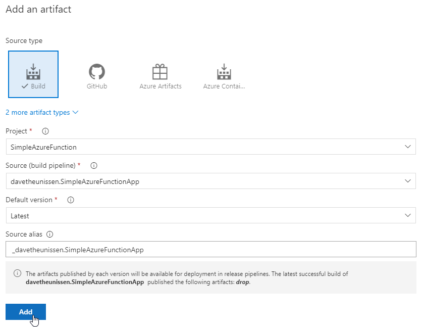

That's it, you now have the artefacts configured for your release. Don't forget to save your changes on the top right as you go along.

***

#### Configure the Deployment Stage

Notice the little red icon indicating that we've got some work to do to get this stage correctly configured. Click on the **1job, 1 task** hyperlink to open the stage configuration panel.

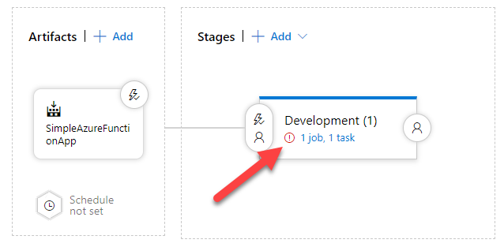

If you are already authenticated with you Azure account, you will be able to select a subscription from the Azure subscription drop down. You will then need to authorize Azure DevOps to talk to your Azure subscription. Once you click authorize, a service principle is created in Azure Active Directory which will be used by Azure DevOps to authenticate to Azure.

The second required parameter is the name of the Function App you created earlier. You should be able to select your function app from the dropdown.

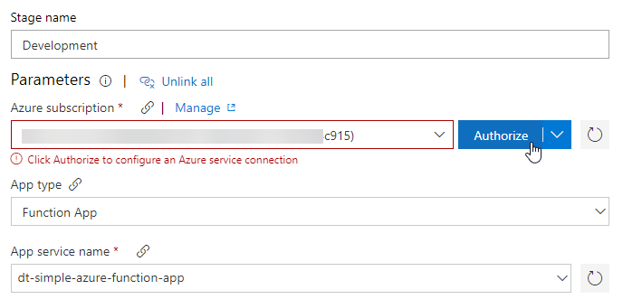

The final piece of configuration is on the Deploy Azure App Service task directly. I've opted to set the version to v4 (preview) so that I can use the [run from zip](https://docs.microsoft.com/en-us/azure/devops/pipelines/tasks/deploy/azure-rm-web-app-deployment?view=vsts#runfromzip) deployment method which is currently in preview. Run from zip essentially mounts the function app package as a zip to the function runtime instance and the artifacts are read directly from the zip file. The benefits include faster cold start response times and atomic deployments because the zip file is essentially a self contained version of your function app artifacts.

For the Package or folder setting use the ellipses on the right to set the path to the artifacts that are produced by the build pipeline

Finally, under **Additional Deployment Options** select deployment method and choose **Run from zip**.

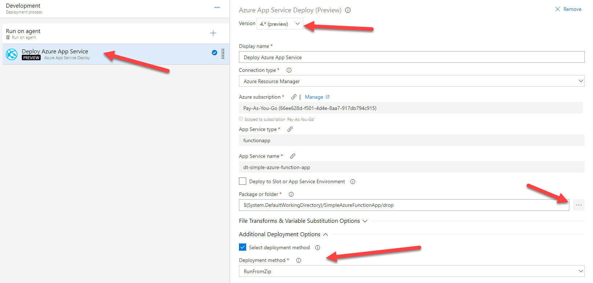

To change the name of your release pipeline, click on the edit icon next to the title.

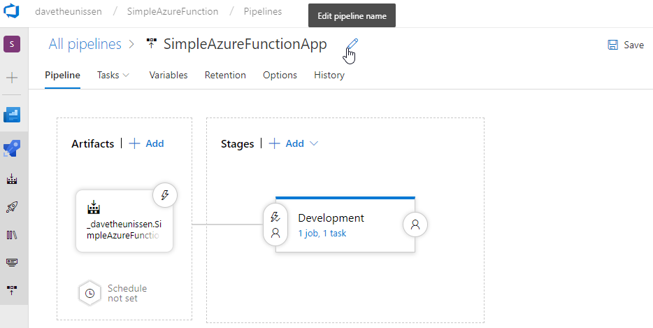

Now that you have your release pipeline configured, save all your changes and head on back to the Release dashboard.

***

### Deploy your Function App

Go ahead an queue a new deployment. When the **Create new release** dialog pops up, leave all the default options as is and deploy.  
If everything is correctly configured, you should have a green deployment and your function app deployed to Azure!

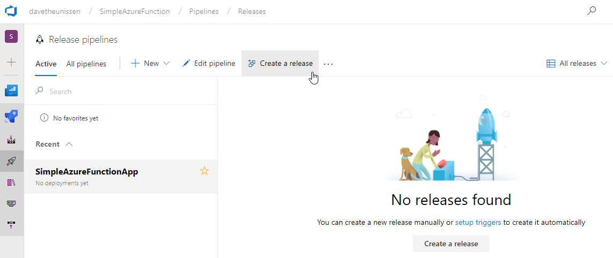

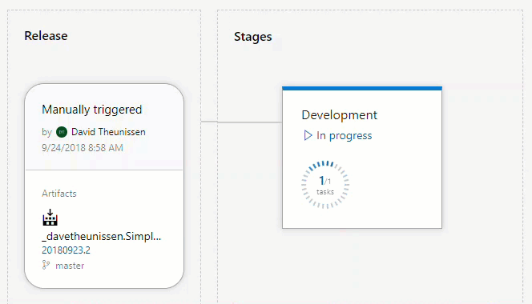

#### Add a Deployment Status Badge

If you are after a sweet release badge as well, head over to the options tab on your release definition, look for the integrations section and enable the deployment status badge. Copy the link and drop it into the README on your repo.

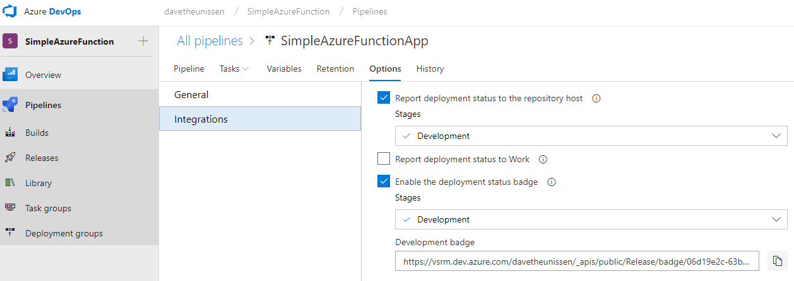

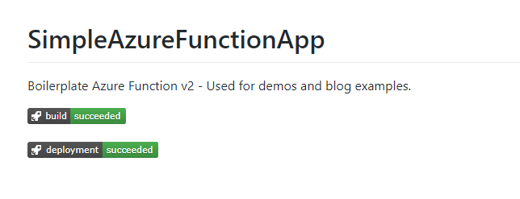

***

#### Test Your Function App in Azure

Now that your Function app has been deployed to Azure, jump into the Azure Portal and open up the Functions blade.

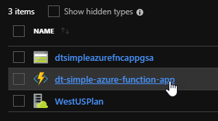

Grab the URL for your newly deployed Function App which will include the Function Key. Edit the URL to include a query parameter with your name `name=dave` in my case and make a request to the endpoint from your browser.

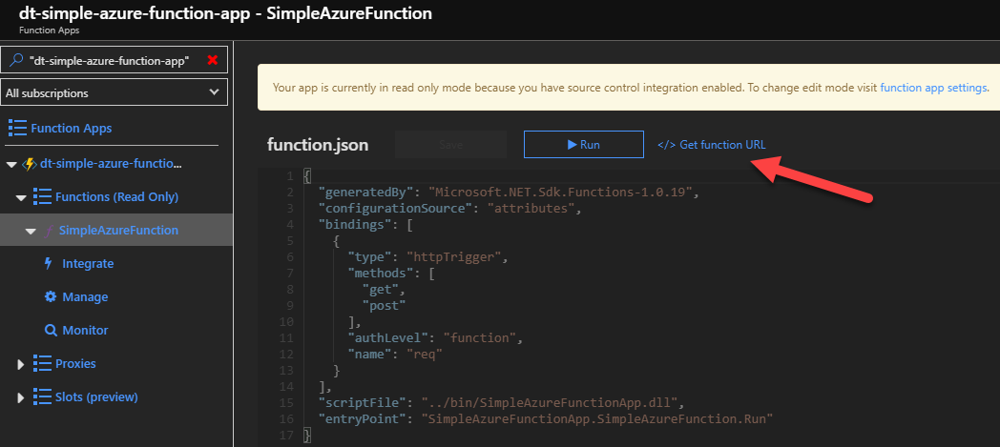

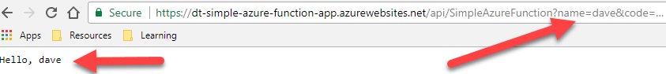

***

## Wrapping up

Azure DevOps provides a really easy to use set of tools and services for getting up and running with fully fledged CI/CD pipelines. Commits to your GitHub repo can be configured to trigger builds and releases with minimal effort. There are tonne of more features in Azure DevOps that aren't covered here, like deployment triggers, release gates, service hooks etc. and the Azure DevOps team are doing a great job iterating and evolving the product. If you want to find out more, head on over to the official [Azure DevOps docs](https://docs.microsoft.com/en-us/azure/devops/?view=vsts).