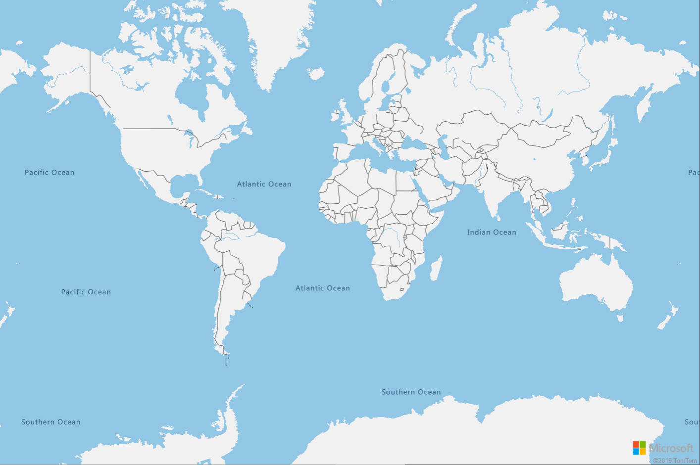
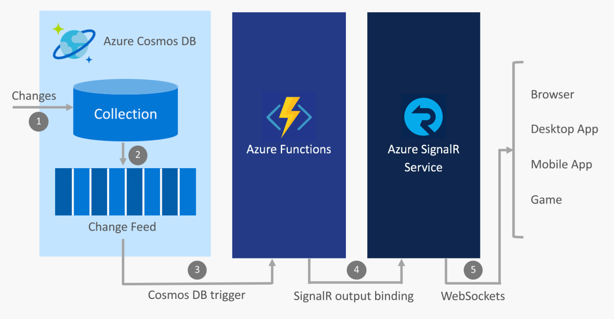
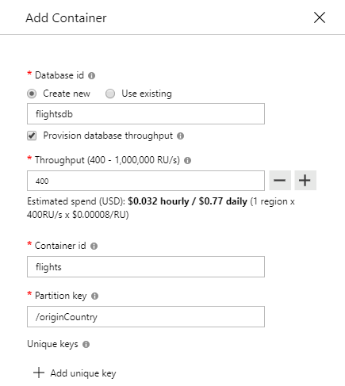
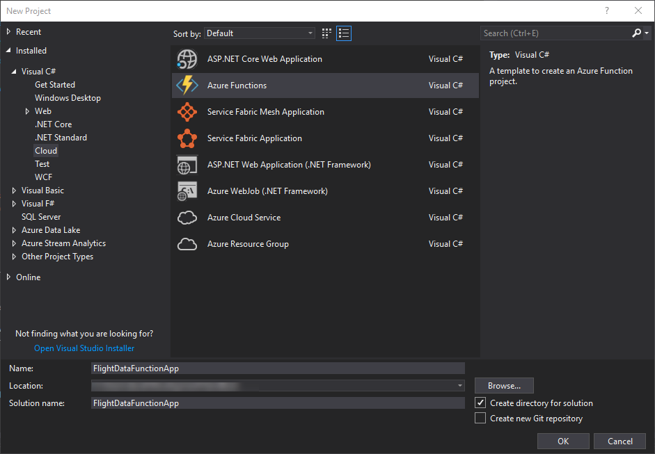
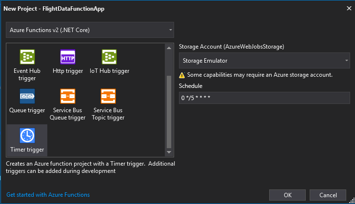
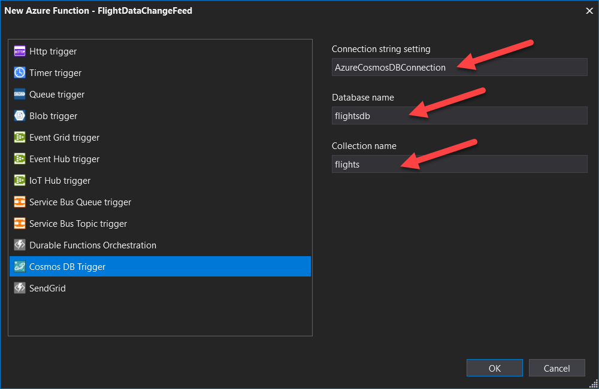
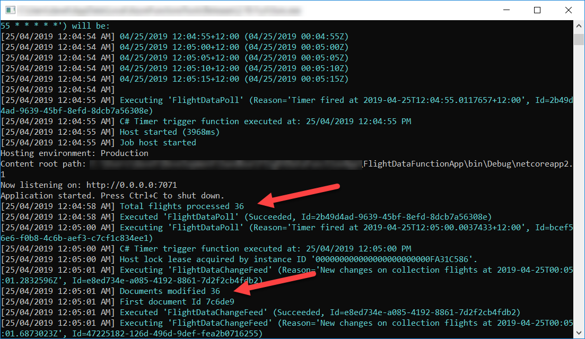
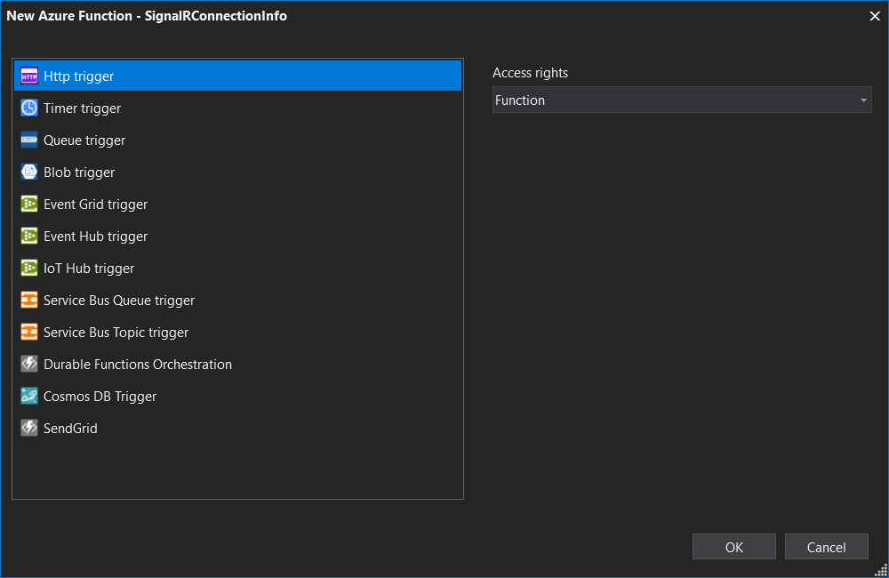

## What we will cover

In this workshop we will be building a (near) real-time flight tracker app that leverages several Azure technologies.

- We will be using Azure Maps to draw the map canvas in our web app.
- To get the flight information, we will create a timer triggered Azure Function to pull the latest flight data set from the OpenSky Network public API. The flight data will then be persisted in a Cosmos Database.
- We will then create an Azure Function that listens to the Cosmos DB change feed and updates an Azure SignalR hub with all changes to the flight data.
- Finally the web app will be configured with a SignalR client to handle the data changes in real-time.

[Grab the sample code and demo app from the GitHub repo](https://github.com/davetheunissen/Global-Azure-Bootcamp-2019-Workshop)

[Watch the live demo recording from the Auckland Azure Global Bootcamp 2019](https://www.youtube.com/watch?v=w_G3S6q02JE).

---

## What you will need

- Microsoft Azure Account
- Visual Studio 2017
- Azure Function CLI Tools _(Will be downloaded automatically when debugging functions locally)_

# Creating the Azure Resources

## Azure Maps

[**Azure Maps from the docs**](https://docs.microsoft.com/en-us/azure/azure-maps/about-azure-maps)

_Azure Maps is a portfolio of geo-spatial services that include service APIs for Maps, Search, Routing, Traffic and Time Zones. The portfolio of Azure OneAPI compliant services allows you to use familiar developer tools to quickly develop and scale solutions that integrate location information into your Azure solutions. Azure Maps provides developers from all industries powerful geo-spatial capabilities packed with fresh mapping data imperative to providing geographic context to web and mobile applications._

### Create a new Azure Maps resource

1. In the upper left corner of the portal, click on 
2. Type in **Maps** in the search bar and select **Maps** in the dropdown.
3. Click the **Create** button that appears on the Maps resource page

   

4. Enter the following information into the **Create Maps Account** template

   | Name           | Value                                                                                                    |
   | -------------- | -------------------------------------------------------------------------------------------------------- |
   | Subscription   | Select your subscription                                                                                 |
   | Resource Group | Select the resource group created above                                                                  |
   | Name           | Give your maps account a meaningful name                                                                 |
   | Pricing Tier   | Select **Standard S0** [See Pricing Info](https://azure.microsoft.com/en-us/pricing/details/azure-maps/) |

5. Read the **License and Privacy Statement** and select the checkbox.

   

6. Once the new Azure Maps resource has been provision, navigate to the newly deployed resource and locate the **Authentication** tab under the **Settings** subheading. You will need to grab the key later on.

---

## Azure SignalR

[**Azure SignalR from the docs**](https://docs.microsoft.com/en-us/azure/azure-signalr/signalr-overview)

_Azure SignalR Service is an Azure managed PaaS service to simplify the development, deployment and management of real time web application using SignalR, with Azure supported SLA, scaling, performance and security. The service provides API/SDK/CLI/UI, and rich set of code samples, templates, and demo applications._

### Create a new Azure SignalR resource

1. In the upper left corner of the portal, click on 
2. Type in **SignalR** in the search bar and select **SignalR Service** in the dropdown.
3. Click the **Create** button that appears on the SignalR Service resource page

   

4. Enter the following information into the **Create SignalR Service** template

   | Name           | Value                                                                                                           |
   | -------------- | --------------------------------------------------------------------------------------------------------------- |
   | Resource Name  | Give your SignalR Service a meaningful name                                                                     |
   | Subscription   | Select your subscription                                                                                        |
   | Resource Group | Select the resource group created above                                                                         |
   | Location       | Select a location to deploy your SignalR Service too                                                            |
   | Pricing Tier   | Select the **Free** tier [See Pricing Info](https://azure.microsoft.com/en-us/pricing/details/signalr-service/) |

   

5. Once the new SignalR Service has been provision, navigate to the newly deployed resource and locate the **Keys** tab under the **Settings** subheading. You will need to grab the connection string later on.

---

## Azure Cosmos DB

[**Azure Cosmos DB from the docs**](https://docs.microsoft.com/en-us/azure/cosmos-db/introduction)

_Azure Cosmos DB is a fully managed, globally-distributed, horizontally scalable in storage and throughput, multi-model database service backed up by comprehensive SLAs. Azure Cosmos DB was built from the ground up with global distribution and horizontal scale at its core - it offers turn-key global distribution across any number of Azure regions by transparently scaling and replicating your data wherever your users are. You can elastically scale throughput and storage worldwide and pay only for the throughput and storage you need. Azure Cosmos DB guarantees single-digit millisecond latencies at the 99th percentile anywhere in the world, offers multiple well-defined consistency models to fine-tune for performance and guaranteed high availability with multi-homing capabilities - all backed by industry leading service level agreements (SLAs)._

_Azure Cosmos DB is truly schema-agnostic - it automatically indexes all the data without requiring you to deal with schema and index management. Azure Cosmos DB is multi-model - it natively supports document, key-value, graph and columnar data models. With Azure Cosmos DB, you can access your data using NoSQL APIs of your choice. Azure Cosmos DB is a fully managed, enterprise ready and trustworthy service. All your data is fully and transparently encrypted and secure by default. Azure Cosmos DB is ISO, FedRAMP, EU, HIPAA, and PCI compliant as well._

### Create a new Azure Cosmos DB instance

1. In the upper left corner of the portal, click on 
2. Type in **Cosmos** in the search bar and select **Azure Cosmos DB** in the dropdown.
3. Click the **Create** button that appears on the Azure Cosmos DB resource page

   

4. Enter the following information into the **Create Azure Cosmos DB** template

   | Name           | Value                                          |
   | -------------- | ---------------------------------------------- |
   | Subscription   | Select your subscription                       |
   | Resource Group | Select the resource group created above        |
   | Account Name   | Give your Cosmos DB a meaningful name          |
   | API            | Select the Core(SQL) API                       |
   | Location       | Select a location to deploy your Cosmos DB too |
   | Geo-Redundancy | Not required so I chose to disabled it         |
   | Multi-Region   | Not required so left disabled by default       |

   

5. Click **Review + Create** and then once the validation has passed, select **Create**
6. Once the new Cosmos DB instance has been provision, navigate to the newly deployed resource and locate the **Keys** tab under the **Settings** subheading. You will need to grab the connection string later on.

# Part 1 - Creating a static Web App

The web app we are going to build is a simple flight tracker app. In part 1 of this session we are going to focus on creating a map of New Zealand that shows static flight data for all current flights over New Zealand air space.

## Create a new Map

1. Open up visual studio code and create a new project directory for this project.
2. In the new project folder create a subdirectory called `Web`
3. In the `Web` directory create a new file called `index.html`
4. Copy the following boilerplate code and then we will fill rest.

```html
<!DOCTYPE html>
<html>
  <head>
    <title>Live Flight Data Map</title>
    <meta charset="utf-8" />
    <meta
      name="viewport"
      content="width=device-width, initial-scale=1, shrink-to-fit=no"
    />

    <!-- Add references to the Azure Maps Map control JavaScript and CSS files. -->
    <link
      rel="stylesheet"
      href="https://atlas.microsoft.com/sdk/javascript/mapcontrol/2/atlas.min.css"
      type="text/css"
    />
    <script src="https://atlas.microsoft.com/sdk/javascript/mapcontrol/2/atlas.min.js"></script>

    <!-- Add a reference to the Azure Maps Services Module JavaScript file. -->
    <script src="https://atlas.microsoft.com/sdk/javascript/mapcontrol/2/atlas-service.min.js"></script>

    <script>
      function GetMap() {
        //Add Map Control JavaScript code here.
      }
    </script>

    <style>
      html,
      body {
        width: 100%;
        height: 100%;
        padding: 0;
        margin: 0;
      }

      #myMap {
        width: 100%;
        height: 100%;
      }
    </style>
  </head>
  <body onload="GetMap()">
    <div id="myMap"></div>
  </body>
</html>
```

5. Go ahead and grab the subscription key for your Azure Maps account that you created earlier.
6. Add the following javascript snippet to the `GetMap()` function and your subscription key to the placeholder.

```javascript
//Instantiate a map object
var map = new atlas.Map("myMap", {
  //Add your Azure Maps subscription key to the map SDK. Get an Azure Maps key at https://azure.com/maps
  authOptions: {
    authType: "subscriptionKey",
    subscriptionKey: "<Your Azure Maps Key>",
  },
});
```

7. Save your changes and open your `index.html` file in a browser. You should now see a really basic map of the world.



## Customize your map

To keep things simple and to ensure that this map of the world include New Zealand, we will scope the map to New Zealand specifically.
Add the following options/settings to the `GetMap()` function, just below the `authOptions` section.

```javascript
style: "night",
center: [171.7799, -40.838875],
zoom: 6
```

Refresh the page in your browser and notice, the map is now zoomed in on New Zealand and we've made it dark!
You might need to tweak the **center coordinates** and **zoom** settings to get a better fit for your screen size and if you are after different styles or other custom configurations, take a look at the **Map** component section of the docs.

- [Supported Styles](https://docs.microsoft.com/en-us/azure/azure-maps/supported-map-styles)
- [Map Control Docs](https://docs.microsoft.com/en-us/javascript/api/azure-maps-control/atlas.map?view=azure-iot-typescript-latest)


## Lets Add Some Flight Data!!

Sweet map... but you said there would be planes! Adding the flight data to the map is going to require a couple of things so lets kick right into it.

First we need to query the [OpenSky Network](https://opensky-network.org/apidoc/) API to get the flight data. The OpenSky Network provide open air traffic data for research and non-commercial purposes. They do provide more comprehensive licensing models should you need it but for the purposes of this workshop we will use the public endpoint.

To simplify matters further and reduce the payload size, given we have scoped our map map to just New Zealand, the RESTful calls to the public API contain the boundary coordinates for New Zealand so that we only fetch flight data for flights on our map.

In your browser or your favorite http client tool run the following GET request to the OpenSky Network API and familiarize yourself with the response body.

- [GET Request](https://opensky-network.org/api/states/all?lamin=-50.00&lomin=160.00&lamax=-30.00&lomax=180.00) `https://opensky-network.org/api/states/all?lamin=-50.00&lomin=160.00&lamax=-30.00&lomax=180.00`

Notice the **longitude** and **latitude** query params, these are just a rough estimate. Feel free to tweak these or make up your own all together. If you do change the location, don't forget to update your maps **center coordinates** we set in the previous step otherwise you won't see any flights in your region later on.

In the interest of brevity, I've listed the fields we will be making use of below. For the full list, checkout the [OpenSky Network API Docs](https://opensky-network.org/apidoc/rest.html#response)

| Index | Property       | Type   | Description                                                                      |
| ----- | -------------- | ------ | -------------------------------------------------------------------------------- |
| 0     | icao24         | string | Unique ICAO 24-bit address of the transponder in hex string representation.      |
| 1     | callsign       | string | Callsign of the vehicle (8 chars). Can be null if no callsign has been received. |
| 2     | origin_country | string | Country name inferred from the ICAO 24-bit address.                              |
| 5     | longitude      | float  | WGS-84 longitude in decimal degrees. Can be null.                                |
| 6     | latitude       | float  | WGS-84 latitude in decimal degrees. Can be null.                                 |
| 7     | baro_altitude  | float  | Barometric altitude in meters. Can be null.                                      |
| 9     | velocity       | float  | Velocity over ground in m/s. Can be null.                                        |
| 10    | true_track     | float  | True track in decimal degrees clockwise from north (north=0°). Can be null.      |

In order to get the flight data, we will use the lightweight promis based HTTP client [Axios](https://github.com/axios/axios) to make a RESTful request to the OpenSky Network API with the request we just tested above. Add the following html script snippet to your `index.html` file to pull down the axios.js dependancies.

```html
<!-- Promis based http client. https://github.com/axios/axios -->
<script src="https://unpkg.com/axios/dist/axios.min.js"></script>
```

Now add the following simple method below the `GetMap()` function to retrieve the flight data. With the function in place, it's time to render the flights on the map.

```javascript
function GetFlightData() {
  return axios
    .get(
      "https://opensky-network.org/api/states/all?lamin=-50.00&lomin=160.00&lamax=-30.00&lomax=180.00"
    )
    .then(function (response) {
      return response;
    })
    .catch(console.error);
}
```

Finally append the below code snippet to the `GetMap()`function. Here we are adding a ready event to the map so that this logic gets executed only after the map has been initialized.
The snippet below does the following

1. Add a image to use as the plane icon to the maps [ImageSprite](https://docs.microsoft.com/en-us/javascript/api/azure-maps-control/atlas.imagespritemanager?view=azure-iot-typescript-latest) collection. The `.png` referenced here is one that I created and is being served up from blob storage. Feel free to use this one or create your own graphics and get creative.

2. The next step is to create a new [DataSource](https://docs.microsoft.com/en-us/javascript/api/azure-maps-control/atlas.source.datasource?view=azure-iot-typescript-latest) which will keep track of the flight data within the map.

3. Next we create a new map [SymbolLayer](https://docs.microsoft.com/en-us/javascript/api/azure-maps-control/atlas.symbollayeroptions?view=azure-iot-typescript-latest) which describes how we want the flight data stored in the data source to be rendered on the map.

   - In the `iconOptions` section we set the image to the plane icon we added to the ImageSprite later earlier on.
   - We also set the **rotation** property of the icon using a function which fetches the value from the data source. This will be the **true_track** value in the flight data payload and "points" the icon in the same direction the flight is currently travelling.
   - In the `textOptions` we add some flight information text which is also fetched from the data source for specific flight. This will render information about the flight next to the icon on the map.

4. Finally make a call to the `GetFlightData()` function we created earlier and foreach flight in the response create a new map [Shape](https://docs.microsoft.com/en-us/javascript/api/azure-maps-control/atlas.shape?view=azure-iot-typescript-latest) and add it to the data source.

   - The **Shape** contains a GeoJSON [Point](https://docs.microsoft.com/en-us/javascript/api/azure-maps-control/atlas.data.point?view=azure-iot-typescript-latest) object which will store the coordinates of a given flight.
   - Then add some custom properties to the **Shape** to store the **Name, Altitude and Rotation** values of the flight which are used in the **SymbolLayer** above when rendering the flight information on the map.

```javascript
//Wait until the map resources are ready.
map.events.add("ready", function () {
  map.imageSprite.add(
    "plane-icon",
    "https://dtazfuncdemogsa.blob.core.windows.net/dt-azfuncdemo-blob/plane.png"
  );

  //Create a data source and add it to the map
  var datasource = new atlas.source.DataSource();
  map.sources.add(datasource);

  //Create a symbol layer using the data source and add it to the map
  map.layers.add(
    new atlas.layer.SymbolLayer(datasource, null, {
      iconOptions: {
        ignorePlacement: true,
        allowOverlap: true,
        image: "plane-icon",
        size: 0.08,
        rotation: ["get", "rotation"],
      },
      textOptions: {
        textField: [
          "concat",
          ["to-string", ["get", "name"]],
          "- ",
          ["get", "altitude"],
        ],
        color: "#FFFFFF",
        offset: [2, 0],
      },
    })
  );

  GetFlightData().then(function (response) {
    for (var flight of response.data.states) {
      var pin = new atlas.Shape(new atlas.data.Point([flight[5], flight[6]]));
      pin.addProperty("name", flight[1]);
      pin.addProperty("altitude", flight[7]);
      pin.addProperty("rotation", flight[10]);
      datasource.add(pin);
    }
  });
});
```

Refresh your browser... and TaDa!! You should now see static plane icons on your map representing the actual flights currently over New Zealand.


# Part 2 - Building Azure Functions to enable real time flight data

In Part 2 of the workshop we will now focus on building out the Azure Functions which will enable real time data updates for the flight data on our map.
The following image describes the flow we are looking to create to enable real time functionality.



1. A change is made in a Cosmos DB collection
2. The change event is propagated to the Cosmos DB change feed
3. An Azure Functions is triggered by the change event using the Cosmos DB trigger
4. The SignalR Service output binding publishes a message to SignalR Service
5. SignalR Service publishes the message to all connected clients

[Take a look at the docs if you want to explore this pattern a little further](https://docs.microsoft.com/en-us/azure/azure-signalr/signalr-concept-azure-functions)

## Create the Cosmos DB & Collection

In order to use the Cosmos DB change feed to track changes to the flight data, we are going to need to create a database and collection to store the information in the first place.

1. In the portal navigate to your Cosmos DB instance we created earlier and open up the **Data Explorer**.
2. In the top left had corner, select **New Container** which will open up the **Add Container** dialog. Fill in the fields as per the table below.

   | Name          | Value                                                                                                     |
   | ------------- | --------------------------------------------------------------------------------------------------------- |
   | Database id   | Select **Create new** and give your database a name. Tick the option to **Provision database throughput** |
   | Throughput    | Leave as the minimum of 400 RUs                                                                           |
   | Container id  | Give your collection a meaningful name                                                                    |
   | Partition Key | Set to /originCountry as this will be derived from our data set.                                          |

   

3. Select **OK** and after a couple of seconds, you should have your new database and collection provisioned.

4. (Optional) - Navigate to the **Settings** section of your new collection.
   - Turn on **Time to live** and set the number of seconds a record should remain before being removed.
   - I've enabled this and set it to 10 min as a quick 'hack' to clear out any stale flight data as that database will constantly be updated with new flight information.

## Timer Triggered Function

In order to get updated flight data we need a mechanism to poll the OpenSky Network APIs for changes. Azure Functions offer [several binding types](https://docs.microsoft.com/en-us/azure/azure-functions/functions-triggers-bindings#supported-bindings), one of which is a Timer Trigger. Timer triggers let you schedule function execution based on a [CRON expression](https://docs.microsoft.com/en-us/azure/azure-functions/functions-bindings-timer#cron-expressions).

1. Open up **Visual Studio 2017** and create a new **Azure Functions** project / solution.

   

2. Make sure you have Azure Functions v2 selected and search for the Timer trigger function template.

   

You should now have a scaffolded Timer Triggered Azure Function that looks something like this. Rename your function to something more meaningful like FlightDataTimerPoll.

- Tweak the timer schedule to something more frequent than 5 minutes so that you get updates more often to your flight data. Here I've opted for 5 seconds so that I can see the planes move on my map later on.

```CSharp
public static class FlightDataPoll
{
    [FunctionName("FlightDataPoll")]
    public static void Run([TimerTrigger("*/5 * * * * *")]TimerInfo myTimer
    ILogger log)
    {
        log.LogInformation($"C# Timer trigger function executed at: {DateTime.Now}");
    }
}
```

The next task is to write the logic to fetch the flight data from the OpenSky API and store it in our database. To do this we are going to make use of the [Cosmos DB Output Binding](https://docs.microsoft.com/en-us/azure/azure-functions/functions-bindings-cosmosdb-v2#output).

To use the Cosmos DB binding extensions you need to add the [Microsoft.Azure.WebJobs.Extensions.CosmosDB](https://www.nuget.org/packages/Microsoft.Azure.WebJobs.Extensions.CosmosDB) package from nuget as a dependency to your project.

1. Copy the `Flight.cs` class from the example source code into your project. This class contains some logic for mapping the API response from OpenSky Network so that we can deserialize the response to a C# object. This is not an important implementation detail for this workshop but make a note that we are setting the **id** field to the **icao24** property for simplicity later on.

2. Add the CosmosDB output binding to your function parameters and add the database & collection names to the ones you just created before.

3. Add an app setting to the **local.settings.json** file called `AzureCosmosDBConnection` and set the value to the connection string for your Cosmos DB instance.

4. Make an http request to the same OpenSky Network API endpoint that we used in Part 1.

5. Deserialize the response into the `Flight.cs` data model and add it to the collection of output documents to be persisted in Cosmos DB.

Your function should end up looking something like below. Notice that the output binding is of type `IAsyncCollector<Flight>` which represents the shape of our Cosmos DB documents.

```csharp
public static class FlightDataPoll
{
    static HttpClient client = new HttpClient();

    [FunctionName("FlightDataPoll")]
    public static async Task RunAsync(
        [TimerTrigger("*/5 * * * * *")]TimerInfo myTimer,
        [CosmosDB(
            databaseName: "flightsdb",
            collectionName: "flights",
            ConnectionStringSetting = "AzureCosmosDBConnection")]IAsyncCollector<Flight> documents,
         ILogger log)
    {
        log.LogInformation($"C# Timer trigger function executed at: {DateTime.Now}");

         var openSkyUrl = "https://opensky-network.org/api/states/all?lamin=-50.00&lomin=160.00&lamax=-30.00&lomax=180.00";

        using (HttpResponseMessage res = await client.GetAsync(openSkyUrl))
        using (HttpContent content = res.Content)
        {
            var result = JsonConvert.DeserializeObject<Rootobject>(await content.ReadAsStringAsync());
            foreach (var item in result.states) {
                await documents.AddAsync(Flight.CreateFromData(item));
            }

            log.LogInformation($"Total flights processed{result.states.Length}");
        }
    }
}
```

Run the function and head on over to the Data Explorer in the Cosmos DB portal. You should start to see documents containing flight data being added to the collection. The next thing to do is to create a mechanism to push the flight data to our SignalR Service that we provisioned earlier. Lets cover that next.

## CosmosDB Change Feed & SignalR Outbound Trigger

To listen for updates to our flight data data-set in CosmosDB we are going to leverage the [CosmosDB Change Feed](https://docs.microsoft.com/en-us/azure/cosmos-db/change-feed). The change feed works by listening for changes to your collection and outputs those changes in the same order they were add or modified. The output from the change feed can then be broadcast to any number of subscribers. We will use the [CosmosDB Trigger binding](https://docs.microsoft.com/en-us/azure/azure-functions/functions-bindings-cosmosdb-v2#trigger) to process the change feed updates in an Azure Function.

In the same Azure Function, we will then use the [SignalR output binding](https://docs.microsoft.com/en-us/azure/azure-functions/functions-bindings-signalr-service#using-signalr-service-with-azure-functions) to push the updated flight data to SignalR.

1. In **Visual Studio 2017** right click on your Function App project and add a new Azure Function and give your function a meaningful name.

2. Pick the **Cosmos DB Trigger** template from the menu and click OK.

   | Name                      | Value                                                                            |
   | ------------------------- | -------------------------------------------------------------------------------- |
   | Connection String Setting | Name of you CosmosDB connection string config property (AzureCosmosDBConnection) |
   | Database name             | Your CosmosDB flight data database name                                          |
   | Collection name           | Your CosmosDB flight data collection name                                        |

   

3. You should now have a function that looks lik below. Notice the template has set the database and collection property names.

4. Add one more property to the Cosmos DB Trigger binding called `CreateLeaseCollectionIfNotExists` and set this to `true` as below. This will create a new lease collection in your database, if one doesn't exist, which is where the change feed will keep a track of which records it has already processed.

```csharp
public static class FlightDataChangeFeed
{
    [FunctionName("FlightDataChangeFeed")]
    public static void Run([CosmosDBTrigger(
        databaseName: "flightsdb",
        collectionName: "flights",
        ConnectionStringSetting = "AzureCosmosDBConnection",
        LeaseCollectionName = "leases",
        CreateLeaseCollectionIfNotExists = true)]IReadOnlyList<Document> input, ILogger log)
    {
        if (input != null && input.Count > 0)
        {
            log.LogInformation("Documents modified " + input.Count);
            log.LogInformation("First document Id " + input[0].Id);
        }
    }
}
```

If you run your function app now, you should get both your timer triggered function and your change feed listener functions spinning up at the same time. If everything is hooked up correctly you should see some log output to the console like below showing how many flights were added into the database and subsequently processed by the change feed.



5. The next step to add the SignalR output binding. To use this binding you will need add the **Microsoft.Azure.WebJobs.Extensions.SignalRService** package dependency from nuget to your project.

6. With the package installed add the binding to your function as per below, setting the **HubName** attribute to `flightdata`

   - The **Target** property is the name of the function to be invoked on the client and the **Arguments** property is the array of objects to be passed to the client.

Your function should now be complete and resemble the logic below.

```csharp
public static class FlightDataChangeFeed
{
    [FunctionName("FlightDataChangeFeed")]
    public static async Task RunAsync(
        [CosmosDBTrigger(
            databaseName: "flightsdb",
            collectionName: "flights",
            ConnectionStringSetting = "AzureCosmosDBConnection",
            LeaseCollectionName = "leases",
            CreateLeaseCollectionIfNotExists = true)]IReadOnlyList<Document> input,
        [SignalR(HubName = "flightdata")] IAsyncCollector<SignalRMessage> signalRMessages,
        ILogger log)
    {
        if (input != null && input.Count > 0)
        {
            log.LogInformation("Documents modified " + input.Count);
            foreach (var flight in input)
            {
                await signalRMessages.AddAsync(new SignalRMessage
                {
                    Target = "newFlightData",
                    Arguments = new[] { flight }
                });
            }
        }
    }
}
```

7. The final thing to do before we run this function is to add the connection string for the SignalR Service to the functions config.

   - Create a new setting property called `"AzureSignalRConnectionString"` and set the value to the connection string for your SignalR instance in Azure.

Once thats done, your functions are all set to go. Let's spin these functions up once again and test out the changes. With the functions running, head on over back the SignalR service in Azure and have a look at the metrics tab. After a couple of minutes you should see some telemetry start to feed through. It can take up to 10-15 minutes before you see data coming through on the metrics blade.

## SignalR Connection Info

We have one more function to create before we can update the front end to connect to SignalR and that is the [Connection info input binding](https://docs.microsoft.com/en-us/azure/azure-functions/functions-bindings-signalr-service#signalr-connection-info-input-binding) which provides the client a valid token and the service endpoint for communicating with the SignalR service instance.

1. Once again in **Visual Studio 2017** project, right click and add a new **Azure Function** and call it **SignalRInfo**

2. Pick the HttpTrigger template which should scaffold out a vanilla Http Triggered function

   

3. Replace the contents of the function with the one below and update the **HubName** property to match the HubName you set in SignalR output binding in the previous function. By convention, the name of the function should be **negotiate** but you can set it to whatever you want.

```csharp
[FunctionName("negotiate")]
public static IActionResult Run(
    [HttpTrigger(AuthorizationLevel.Function)] HttpRequest req,
    [SignalRConnectionInfo(HubName = "flightdata")] SignalRConnectionInfo connectionInfo,
    ILogger log)
{
    return new OkObjectResult(connectionInfo);
}
```

Run your Function App again and make a request to your **SignalRConnectionInfo** endpoint. You should see a service endpoint url which matches your deployed SignalR service in Azure and an access token for that service.


4. The final thing to do for local development only is to set the **CORS** settings for your function app. This is done because locally your functions will be running on localhost but your web app is simply being served up from the file system. Add the following code snippet to your `local.settings.json` file to enable cross origin requests.

```json
  "Host": {
    "LocalHttpPort": 7071,
    "CORS": "*"
  }
```

With that done, we are now ready update the client app to connect to SignalR and start receiving real time updates to the flight data on the front end.

# Part 3 - Connect the Web App to Azure SignalR

The first thing we need to here is add some logic to connect to SignalR from the client. To do this we will use the [ASP.NET Core SignalR JavaScript Client](https://docs.microsoft.com/en-us/aspnet/core/signalr/javascript-client?view=aspnetcore-2.2) library.

- Add the following script snippet to your `index.html` file to add the **signalR.js** dependencies to your web app.

```html
<script src="https://unpkg.com/@aspnet/signalr@1.0.2/dist/browser/signalr.js"></script>
```

Next we need to add a couple of functions to initiate the connection with the SignalR service.

1. First add a new function that will call the **SignalRConnectionInfo** endpoint that we created just before.

```javascript
function GetConnectionInfo() {
  return axios
    .get("http://localhost:7071/api/negotiate")
    .then(function (response) {
      return response.data;
    })
    .catch(console.error);
}
```

2. Next add another function just below to initiate the connection with SignalR. If a connection is established, retry after a couple of seconds. Usually in a real world scenario, you'd use some back-off logic or circuit breaker pattern to better handle this scenario.

```javascript
function StartConnection(connection) {
  console.log("connecting...");
  connection
    .start()
    .then(function () {
      console.log("connected!");
    })
    .catch(function (err) {
      console.error(err);
      setTimeout(function () {
        StartConnection(connection);
      }, 2000);
    });
}
```

3. Now we need to do some refactoring of the Web App so that we can 'redraw' the planes on the map each time we get a new set of flight data.

   - Remove the `GetFlightData()` method we created in Part 1
   - Create a new method called `ProcessFlightData(flight)` and add the logic contained in the code snippet below.
   - Also create two local variables to store a reference to the maps **datasource** and a collection of all the current flight data.

   ```javascript
   let datasource;
   let planes = [];

   function ProcessFlightData(flight) {
     console.log(flight);

     var newFlightPin = new atlas.Shape(
       new atlas.data.Point([flight.longitute, flight.latitude]),
       flight.id
     );
     newFlightPin.addProperty("name", flight.callsign);
     newFlightPin.addProperty("altitude", flight.altitude);
     newFlightPin.addProperty("rotation", flight.trueTrack);

     planes[flight.id] = newFlightPin;
     datasource.setShapes(Object.values(planes));
   }
   ```

   The `ProcessFlightData(flight)` method will be called each time the SignalR connection receives an update from the **flightdata** hub. At which point we create a new **shape** for the map to reflect the new properties, add the shape to the collection of planes in local memory and update the maps **datasource** with the update plane collection values.

4. Remove the call to `GetFlightData()` from the `GetMap()` function as we now handle this in the `ProcessFlightData(flight)` method we just created.

5. Where the datasource is initialized, remove the `var` tag so that it gets set to the local variable we also just created.

6. The final step is to initialize the **SiganlR** connection and tell the signalr.js client which method to invoke on our web app each time it receives updates.

   - Add the following code snippet to the Map **ready** event so that the connection gets created once the map has been loaded.
   - This logic makes a request to the `GetConnectionInfo` method to get the url and access token of the SignalR service.
   - Once a token has been acquired, create a new connection using the `SignalR.HubConnectionBuilder` method, passing in the url and access token as options.
   - Start the connection and once connected, each time a new message appears in the **newFlightData** hub, make a call to the `ProcessFlightData(flight)` method.
   - If the connection gets lost, retry starting the connection after a couple of seconds

```javascript
GetConnectionInfo()
  .then(function (info) {
    let accessToken = info.accessToken;
    const options = {
      accessTokenFactory: function () {
        if (accessToken) {
          const _accessToken = accessToken;
          accessToken = null;
          return _accessToken;
        } else {
          return GetConnectionInfo().then(function (info) {
            return info.accessToken;
          });
        }
      },
    };

    const connection = new signalR.HubConnectionBuilder()
      .withUrl(info.url, options)
      .build();

    StartConnection(connection);

    connection.on("newFlightData", ProcessFlightData);

    connection.onclose(function () {
      console.log("disconnected");
      setTimeout(function () {
        StartConnection(connection);
      }, 5000);
    });
  })
  .catch(console.error);
```

#### Thats everything wired up!

You should now be able to run your Azure Function App, open your web app in a browser and after a couple seconds, see some flights rendered on the map. Open up the console to view trace logs if you want to inspect the flight data objects.


Obviously this is only just scratching the surface of what we could do with this particular example or even with other use cases for real time web apps using Azure Functions, CosmosDB and SignalR. I hope you enjoyed this exercise as much as I did putting it together.

Thank You!
