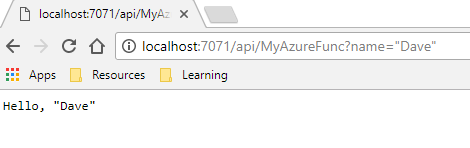
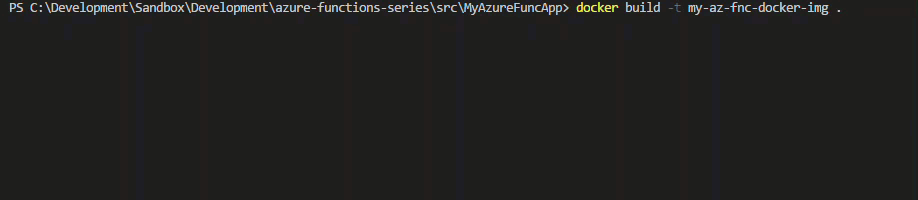

## Content

- [Whats Covered](#whats-covered)

## Whats Covered

This post covers how to create a simple http triggered azure function and bundle it up with the azure functions runtime as a docker image. From there you will publish the image to a private Azure Container Registry. You will then deploy the image from ACR to a Azure Kubernetes Service. Finally you will expose a k8s service and invoke your function.

## What you will need

- [Microsoft Azure Account](https://azure.microsoft.com/en-us/free/)
- Azure CLI
- [Azure Functions Core Tools](https://github.com/Azure/azure-functions-core-tools)
- Docker
- Docker Registry - ACR in this case but you could use docker hub
- Kubernetes Cluster - We will use AKS.

## Part 1 - Create and Run an Azure Function

Part 1 of this post will show you how to create and run an Azure Function.

### Step 1 - Create a new working directory for your function

```cmd
mkdir YourFunctionName
cd YourFunctionName
```

### Step 2 - Create a new Azure Function App

Azure Functions Core Tools gives you the ability to scafold new Azure Function Apps quickly via the command line. The core tools include a `--docker` flag which will create a Docker file when setting up the new project.

Run `func init --docker` and select dotnet as the runtime. Inspect the project thats been created and notice the Dockerfile which should look similar to this

```docker
FROM microsoft/azure-functions-dotnet-core2.0:2.0
ENV AzureWebJobsScriptRoot=/home/site/wwwroot
COPY . /home/site/wwwroot
```

### Step 3 - Create a new Http Triggered Azure Function

For this workshop, we will use a basic http triggered function. 

Run `func new --name YourFunctionName` and select `HttpTrigger` from the list of options.

Inspect the files that have been created. You will see a .cs file with your functions name. The function that has been created is a simple http function that takes a name as a query string and returns that text in a response.

### Step 4 - Build and run your function

To build and execute your function run `func start --build`


Open the function url in your browser. Add a query string parameter for your name and send the request. You should see a response similar to below.



### Step 5 - Create a Docker Image

Start off by building a Docker image that includes your function and the Azure Functions runtime. The Docker file that was created at the beginning will pull down the functions runtime.

To build the docker image run `docker build -t my-az-fnc-docker-img .` (Don't miss the period at the end of the command.)



### Step 6 - Publish your Docker image to Azure Container Registry